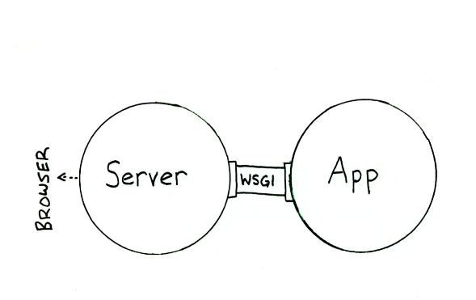

# Información del proyecto
## Descripción del proyecto

Este proyecto va a consitir en un servicio en el cual hay una serie de vulnerabilidades conocidas y reconocidas, por lo que un usuario registrado podra pasarle los datos que quiere comprobar y se le devolvera otros datos, una vez que se haya comparado con la base de datos. La base de datos se rellenará a partir de otra que es pública. La finalidad es pasarle un listado de servicios instalados en una maquina, el servicio los analiza y lo compara con la base de datos, los datos devueltos serán de utilidad para arreglar deficiencias.

## Servicios necesarios

    Lenguaje: Python 3.4
    Base datos: MongoDB
    Test de integración: TravisCI

Repositorio para el proyecto de la asignatura Infrastructura Virtual 2017-2018.

## Despliegue en PaaS

Para este proyecto utilizaré el paas de Heroku, en los que para poder desplegarlo he seguido los siguientes pasos:

1. Dar de alta en la web de [Heroku](https://dashboard.heroku.com/login)
2. Instalar toolbelt de Heroku

    `wget -qO- https://cli-assets.heroku.com/install-ubuntu.sh | sh`

3. Iniciamos sesión en heroku

    `heroku login`

4. Creamos el fichero runtime.txt, indicando la versión de python ejecutará la aplicación.
5. Creamos el fichero Procfile, donde indicamos como arranca nuestra aplicación.
6. Creamos la aplicación de Heroku

    `heroku create`

7. Añadimos la base de datos mongoDB de mlab a la aplicación anterior.
8. Subimos la aplicación a Heroku

    `git push heroku master`

Despliegue https://frozen-everglades-36730.herokuapp.com/

## Despliegue en contenedor

### Proceso para desplegar la aplicación.

1. Darse de alta en zeit
2. Instalar now
3. Subir el proyecto con el Dockerfile

También para reducir el proceso y se puede realizar con

		docker pull ainokila/iv

https://hub.docker.com/r/ainokila/proyectoiv/~/dockerfile/

De esta manera ya se podrá desplegar el contenedor personalizado.

Contenedor: https://proyectoiv-rkuypdqhfx.now.sh

## Hito 5 - Azure

### Proyecto

Este proyecto formará parte de un sistema para analizar ordenadores y obtener las vulnerabilidades que presenta, asi como sus exploit. Actualmente en esta asignatura he desarrollado la parte que se encarga de tener la api para poder buscar los CVE por producto y versión, asi luego que puedan ser utilizado para buscar los exploits indicados.

El diseño del proyecto final sería:

### Configuración para el despliegue en produción - ¡IMPORTANTE!

Al salir del ambito de desarrollo, no podemos seguir utilizando la aplicación en modo debug, ya que si lo dejamos activado, podriamos ser vulnerables. Por tanto 
al desactivar el modo de debug, necesitamos que una aplicación haga de servidor y se comunique con nuestra aplicación, mas o menos esta sería su arquitectura:

En mi caso, he utilizago gunicorn es un WSGI (Web Server Gateway Interface), su función principal es recibir las peticiones en el puerto que le indiquemos, y pasarselas a nuestra aplicación a modo de proxy.

Otra opcion disponible, era utilizar nginx ( en mi caso, he utilizado nginx en el despliegue de DAI), pero como en este caso no quería servir contenido estático, opte por gunicorn.

### Despliegue en maquina virtual - Azure

1. Darse de alta usando el cupón proporcionado por el profesor.
2. Instalar el plugin de azure para Vagrant.

		vagrant plugin install vagrant-azure

3. Instalar el cliente de azure para terminal.

		echo "deb [arch=amd64] https://packages.microsoft.com/repos/azure-cli/ wheezy main" | \ sudo tee /etc/apt/sources.list.d/azure-cli.list
		sudo apt-key adv --keyserver packages.microsoft.com --recv-keys 52E16F86FEE04B979B07E28DB02C46DF417A0893
		sudo apt-get install apt-transport-https
		sudo apt-get update && sudo apt-get install azure-cli

4. Loguearnos en azure con:

		azure login

5. Obtener las claves a traves del azure-cli para poder acceder a traves de Vagrant a Azure.

		az ad sp create-for-rbac

6. Obtendremos las claves en formato json.

		{
		  "appId": "XXXXXXXX-XXXX-XXXX-XXXX-XXXXXXXXXXXX",
		  "displayName": "some-display-name",
		  "name": "http://azure-cli-2017-04-03-15-30-52",
		  "password": "XXXXXXXXXXXXXXXXXXXX",
		  "tenant": "XXXXXXXX-XXXX-XXXX-XXXX-XXXXXXXXXXXX"
		}

7. Exportar las claves anteriores a nuestro ordenador para que se puedan utilizar a través de Vagrant.
8. Crear la maquina virtual y provisionarla con ansible usando:

		vagrant up --provider=azure

9. Si queremos que todo el proceso se haga de manera automatica debemos usar:

		vagrant up --provider=azure
		fab -f ./despliegue/fabfile.py -H vagrant@basecve.westeurope.cloudapp.azure.com removecve
		fab -f ./despliegue/fabfile.py -H vagrant@basecve.westeurope.cloudapp.azure.com installcve
		fab -f ./despliegue/fabfile.py -H vagrant@basecve.westeurope.cloudapp.azure.com startcve

10. Después de esperar ya tendremos nuestro sistema funcionando en produción.
11. Para automatizar el proceso he creado un script que realiza todo lo anterior.

		sh ./provision/install-and-run.sh

En caso de que la maquina virtual ya este configurada, se actualizará y ejecutará el inicio de la aplicación a través de fabric.

12. También si queremos matar el proceso del servidor podemos utilizar:

		fab -f ./despliegue/fabfile.py -H vagrant@basecve.westeurope.cloudapp.azure.com stop_cve

Despliegue final: http://basecve.westeurope.cloudapp.azure.com

